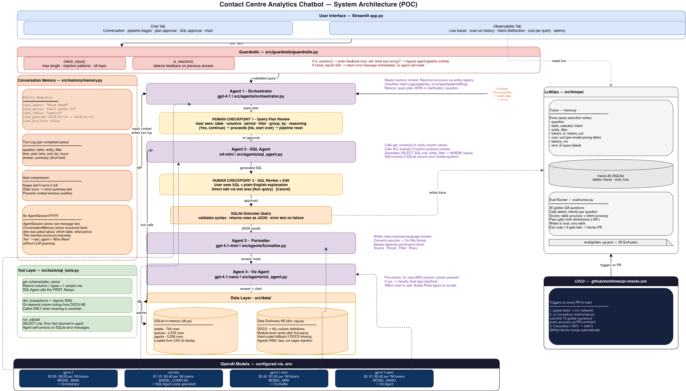

# POC - Contact Centre Analytics Chatbot

A multi-agent analytics chatbot built over January 2026 contact centre data.
Ask natural language questions, approve the query plan, see the SQL, run it, get a clean answer.

Built as a proof-of-concept  - designed to show agentic AI
principles in practice.

---


---

## Quick start

You need Python 3.11+, [uv](https://github.com/astral-sh/uv), and an OpenAI API key.

```bash
# 1. clone
git clone https://github.com/YOUR_USERNAME/cc-chatbot.git
cd cc-chatbot

# 2. install uv if you don't have it
curl -LsSf https://astral.sh/uv/install.sh | sh

# 3. install dependencies
uv sync

# 4. set your API key
cp .env.example .env
# open .env and set OPENAI_API_KEY=sk-...

# 5. run
uv run streamlit run app.py
```

Open link in browser, ask questions about the contact centre data, see the SQL, get answers.

That's it. 

---

## Project structure

```
cc-chatbot/
├── app.py                          main Streamlit app (Chat + Observability tabs)
├── data/
│   ├── estate.csv                  whole contact centre hourly data - Synthetic
│   ├── queues.csv                  per-queue hourly data Synthetic
│   ├── agents.csv                  per-agent hourly data Synthetic
│   └── data_dictionary.docx        column definitions - used as Agentic RAG KB
├── src/
│   ├── agents/
│   │   ├── base.py                 Agent class and AgentSession
│   │   ├── client_factory.py       model routing 
│   │   ├── orchestrator.py         Agent 1 - intent, entity resolution, memory
│   │   ├── sql_agent.py            Agent 2 - schema lookup, SQL generation
│   │   ├── formatter.py            Agent 3 - clean answer with provenance block
│   │   └── viz_agent.py            Agent 4 - decides if a chart is appropriate
│   ├── data/
│   │   ├── loader.py               CSV loading, timestamp normalisation
│   │   ├── db.py                   loads CSVs into in-memory SQLite
│   │   └── dict_rag.py             DOCX parser - Agentic RAG knowledge base
│   ├── tools/
│   │   └── sql_tools.py            get_schema(), run_sql(), dict_lookup() tools
│   ├── memory/
│   │   └── memory.py               ConversationMemory - entity registry, compression
│   ├── guardrails/
│   │   └── guardrails.py           input validation, reaction detection
│   └── llmops/
│       └── tracer.py               SQLite trace logging - cost, latency, tokens
├── eval/
│   ├── golden_qa.json              30 ground-truth questions - Synthetic
│   └── runner.py                   eval runner - scores table + intent accuracy
├── tests/
│   ├── test_loader.py
│   ├── test_dict_rag.py
│   ├── test_base.py
│   ├── test_sql_tools.py
│   └── test_tracer.py
└── .github/workflows/
    └── pr-checks.yml               CI: tests + eval gate on every PR
```

---


## Running tests

```bash
# all tests - no network, no OpenAI calls
uv run pytest tests/ -v

# just tool tests
uv run pytest tests/test_sql_tools.py -v
```

---

## Running the eval

```bash
# quick - first 5 questions only (cheap, fast)
uv run python eval/runner.py Q01 Q02 Q03 Q04 Q05

# full 30-question eval 
uv run python eval/runner.py
```

The eval scores table selection accuracy and intent classification accuracy.
Passes if both are >= 90%. Results are also visible in the Observability tab.

---
## Assumptions

- Current date is fixed to **2026-01-31** - the last day of the available data
- "Business hours" means 08:00–17:59
- "Last week" means Jan 25-31, "first half" means Jan 1-15, "second half" means Jan 16-31
- The data dictionary DOCX is loaded at startup - if missing, a hardcoded fallback is used

---

## Known limitations

- Derived metrics (staffing, weighted averages) use ad-hoc SQL rather than canonical formulas.
  A proper Erlang C tool would give more consistent staffing estimates.
- Metric consistency across a session is not enforced - asking about "most calls" twice
  in different ways may use different columns (All Ans vs In Ans).
  Fix can be: store columns_used in ConversationMemory and pass to orchestrator.
- No streaming - responses appear all at once after the full pipeline completes.
- Ollama/local models can be integrated but are not included or tested in this POC. client_factory.py is designed to support them, but might require tweaks to code, prompt formats and guardrails for non-OpenAI models.

---
